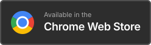
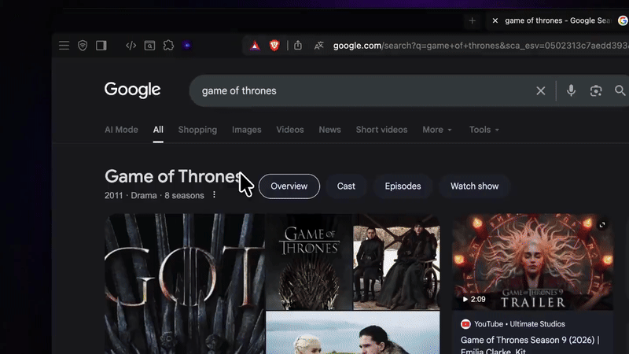
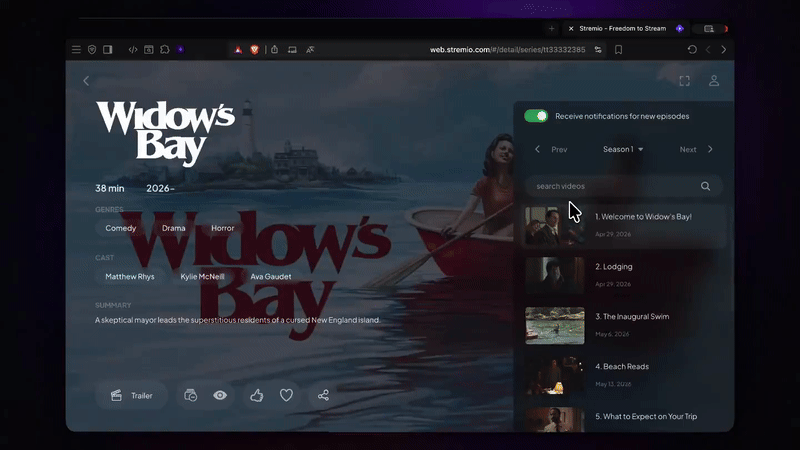

<div align="center">
  
  <h1>StremioHub</h1>
  <p><b>El compañero todo-en-uno de Stremio para tu navegador.</b></p>
  <p>
    <a href="#features">Características</a> •
    <a href="#installation-developer-mode">Instalación</a> •
    <a href="#chrome-web-store">Chrome Web Store</a>
  </p>
  <p>
    <a href="README_AR.md">🇸🇦 Read in Arabic (اقرأ بالعربية)</a>
  </p>
  
  
  
</div>
<div align="center">
  <a href='https://ko-fi.com/V8P5206X9H' target='_blank'>
    
  </a>
  &nbsp;
  <a href='https://chromewebstore.google.com/detail/stremiohub/kkmkapcckkkgblkcgmngehcejpbpddeg' target='_blank'>
    
  </a>
  &nbsp;
  <a href='https://addons.mozilla.org/en-US/firefox/addon/stremiohub/' target='_blank'>
    
  </a>
</div>

---

<div align="center">
  <em>Gestiona tu biblioteca de Stremio directamente desde tu navegador. ¡Añade instantáneamente películas y series a tu biblioteca desde sitios como Google, IMDB, TMDB, Letterboxd, Rotten Tomatoes y Metacritic!</em>
</div>

## ✨ Características

- **🌐 Integración entre sitios**: Añade botones inteligentes de "Guardar en biblioteca" y "Abrir en Stremio" directamente en tus sitios favoritos de descubrimiento de películas.
- **🖱️ Búsqueda rápida con clic derecho**: Resalta el nombre de cualquier película o programa, haz clic derecho e instántaneamente búscalo en Stremio.
- **📚 Gestión completa de la biblioteca**: Visualiza, filtra, ordena y marca elementos como vistos (Películas, Series y Continuar viendo) de forma nativa en el popup de tu navegador.
- **✨ Stremio Web Enhancer** *(Nuevo)*: Personaliza Stremio Web con temas negros OLED profundos, tipografía personalizada en árabe/inglés (como Thmanyah), colores de acento personalizados y calificaciones de la comunidad inyectadas.
- **👥 Multicuenta y Avatares**: Cambia sin problemas entre múltiples cuentas de Stremio y asígnales avatares personalizados atractivos.
- **🧩 Gestor de Addons** *(Nuevo en v1.3.0)*: Instala, elimina, reordena y gestiona tus addons de Stremio — con edición de catálogos por addon — todo desde la extensión.
- **🎨 UI de Glassmorphism**: Un diseño premium inspirado en Apple con modo oscuro impresionante y micro-animaciones sumamente fluidas.
- **🔗 Soporte inteligente de Add-ons**: Obtiene dinámicamente descripciones y metadatos de tus addons reales de Stremio (como TMDB) para proporcionar un contexto rico y localizado.
- **🌍 Soporte bilingüe**: Soporte completo para árabe e inglés con alineaciones nativas de derecha a izquierda (RTL) y alternancia en vivo.
- **🛠 Altamente personalizable**: ¡Elige entre tarjetas emergentes flotantes o vistas de detalles inmersivas a pantalla completa, ajusta el tamaño del popup y más!

## 🧩 Gestor de Addons — v1.3.0

Ahora hay un panel de gestión de addons completo integrado directamente en la configuración de la extensión. No es necesario abrir el sitio web de Stremio para gestionar tus addons.

| Característica | Descripción |
|---|---|
| 📋 **Ver addons instalados** | Mira todos tus addons de Stremio con logos, nombres y descripciones |
| ➕ **Instalar por URL** | Pega un enlace `manifest.json` para instalar cualquier addon instantáneamente |
| 🗑️ **Eliminar addons** | Elimina addons con un aviso de copia de seguridad preventivo antes de cada cambio |
| ↕️ **Reordenar arrastrando y soltando** | Reorganiza la prioridad de tus addons arrastrando y soltando |
| 🗂️ **Editar catálogos** | Renombra o oculta catálogos individuales por addon |
| 🔄 **Sincronizar con Stremio** | Envía todos los cambios a tu cuenta de Stremio con un toque |
| ♻️ **Botón de refrescar** | Recarga tu lista de addons desde el servidor en cualquier momento |
| 💾 **Respaldo y Restauración** | Exporta tu configuración de addons como JSON y restáurala cuando quieras |
| 🔐 **Respaldo automático silencioso** | Copia de seguridad automática y silenciosa antes de editar catálogos |
| 🔁 **Consciente de la cuenta** | La lista de addons se reinicia automáticamente al cambiar de cuenta |

<details>
<summary><b>🎬 Demostraciones de Características</b></summary>
<br>

**1. Auto-guardado desde sitios externos**  
¡Inyecta sin problemas botones de "Guardar en biblioteca" en sitios como Google Search, Letterboxd, IMDB, Metacritic, Rotten Tomatoes y Trakt!


**2. Búsqueda rápida mediante clic derecho**  
Resalta cualquier texto, haz clic derecho e instantáneamente búscalo en Stremio.


**3. Gestionar progreso de visualización**  
Marca fácilmente episodios o películas como vistos directamente desde el popup.


</details>

## 🏪 Tiendas Oficiales

<div align="center">
  <a href="https://chromewebstore.google.com/detail/stremiohub/kkmkapcckkkgblkcgmngehcejpbpddeg" target="_blank">
    
  </a>
  &nbsp;&nbsp;
  <a href="https://addons.mozilla.org/en-US/firefox/addon/stremiohub/" target="_blank">
    
  </a>
</div>

**¡StremioHub está disponible oficialmente en Chrome Web Store y Firefox Add-ons!**  
Instálalo con un clic, sin necesidad del modo desarrollador. Actualizaciones automáticas incluidas.

👉 [Instalar para Chrome](https://chromewebstore.google.com/detail/stremiohub/kkmkapcckkkgblkcgmngehcejpbpddeg)  
👉 [Instalar para Firefox](https://addons.mozilla.org/en-US/firefox/addon/stremiohub/)

## 🛠 Instalación Manual (Modo Desarrollador)

Alternativamente, puedes cargar la extensión manualmente:

1. **Descarga la última versión:** Ve a la [página de Releases](https://github.com/3-pr/StremioHub/releases) y descarga el archivo `.zip`, luego extráelo.
   *O clona el repositorio:*
   ```bash
   git clone https://github.com/3-pr/StremioHub.git
   ```
2. Abre Chrome y navega a `chrome://extensions/`.
3. Activa el **Modo de desarrollador** (interruptor en la esquina superior derecha).
4
4. Haz clic en **Cargar descomprimida** y selecciona la carpeta `extension`.
5. ¡Fija la extensión, inicia sesión con tu cuenta de Stremio y disfruta!

### 🦊 Firefox
Carga la carpeta `extension-firefox` en `about:debugging#/runtime/this-firefox`.

## 🔐 Privacidad y Seguridad

- **No se almacenan contraseñas**: Tus credenciales de Stremio se utilizan una sola vez para obtener un `authKey`.
- **Solo almacenamiento local**: Todos tus datos, caché de biblioteca y configuraciones se guardan de forma segura y localmente en tu navegador usando `chrome.storage.local`.
- **Sin analíticas**: No rastreamos tu biblioteca, búsquedas ni actividad web.

## ⚠️ Descargo de responsabilidad

**StremioHub es una extensión no oficial creada por la comunidad.** No está afiliada, respaldada ni conectada oficialmente al equipo de Stremio.

## 📋 Registro de Cambios

### v1.5.0 — Fuentes Personalizadas y Actualizaciones Automáticas
- ✅ **Carga de fuentes personalizadas**: Sube y aplica tus propias fuentes (.ttf, .woff, .woff2) directamente a la UI de Stremio Web.
- ✅ **Verificador de actualizaciones de addons**: Verifica automáticamente versiones más recientes de los addons de Stremio instalados cada 24 horas.
- ✅ **Soporte para actualizaciones manuales**: Actualiza addons complejos de forma segura preservando las configuraciones.
- ✅ **Estabilidad en Firefox**: Se corrigieron errores donde el selector de archivos cerraba el popup de la extensión en Firefox.
- ✅ **Traducción**: Localización completa al inglés y árabe para las nuevas funciones.

### v1.4.2
- Corrección del problema del fondo negro del tema OLED en la barra de control del reproductor de video en Stremio Web.
- Corrección del renderizado de la fuente personalizada Thmanyah en Stremio Web y subtítulos nativos.
- Se añade visualización dinámica de la versión en los ajustes del popup.
- Se elimina el permiso `tabs` innecesario del manifiesto para mejorar la privacidad.

### v1.4.0 — Stremio Web Enhancer y Multicuenta
- ✅ Personaliza Stremio Web con un tema negro OLED profundo.
- ✅ Inyecta tipografía personalizada (fuentes árabe/inglés) en la UI de Stremio Web y Subtítulos.
- ✅ Cambia el color de acento predeterminado de Stremio Web a tu color favorito.
- ✅ Inyecta calificaciones de la comunidad (Rotten Tomatoes, Metacritic, Letterboxd) vía MDBList/PublicMetaDB.
- ✅ Selector de cuentas: guarda múltiples cuentas de Stremio y cambia con un clic.
- ✅ Avatares personalizados: asigna avatares geniales a tus cuentas guardadas.

### v1.3.0 — Gestor de Addons
- ✅ Panel completo de gestión de addons (instalar, eliminar, reordenar, sincronizar).
- ✅ Edición de catálogos por addon (renombrar, mostrar/ocultar catálogos).
- ✅ Reordenación de addons arrastrando y soltando.
- ✅ Respaldo y restauración de la configuración de addons como JSON.
- ✅ Respaldo automático silencioso antes de acciones destructivas.
- ✅ Botón de refresco manual para recargar addons desde el servidor.
- ✅ Consciente de la cuenta: la lista de addons se reinicia al cambiar de cuenta.
- ✅ Localización completa al árabe e inglés para toda la nueva UI.
- ✅ Portado a extensión de Firefox.

### v1.2.3
- Persistencia de estado entre sesiones del popup.
- Mejoras en el port de Firefox.

<br>
<div align="center">
  <p>Hecho con amor para la comunidad de Stremio 🍿 por <b>Yasser</b></p>
</div>
