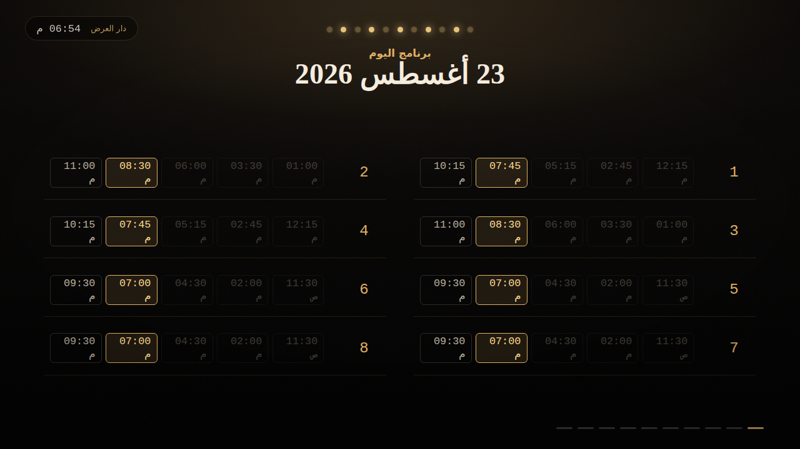
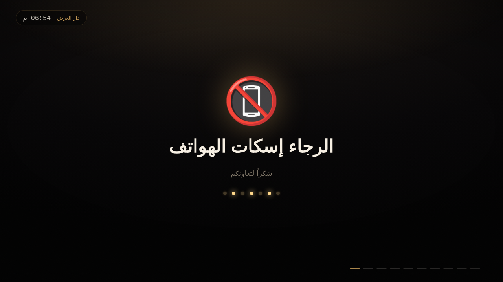
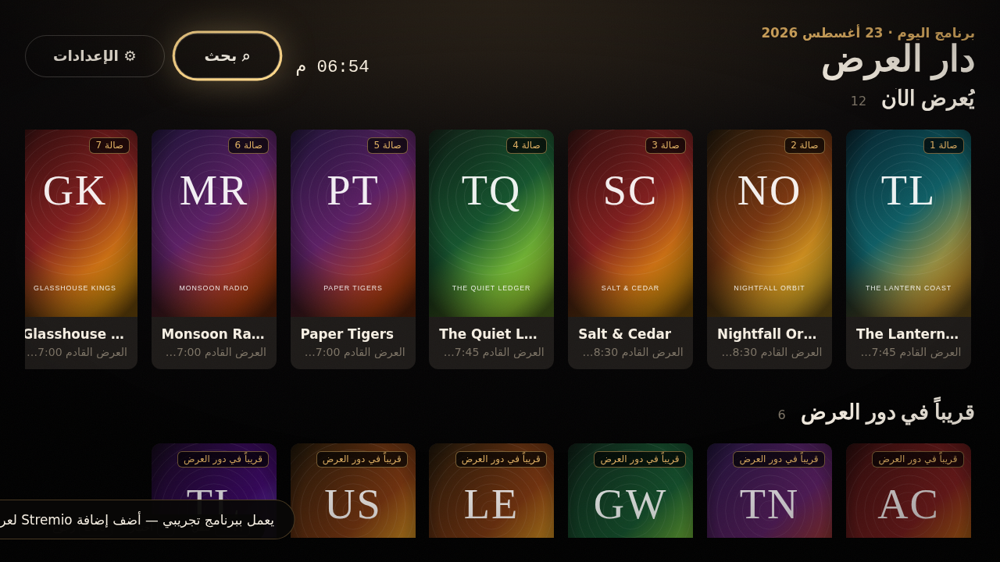
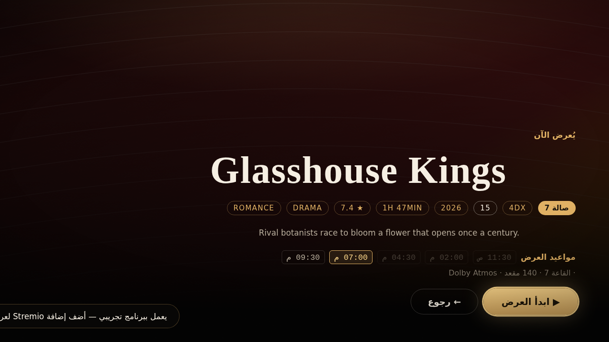
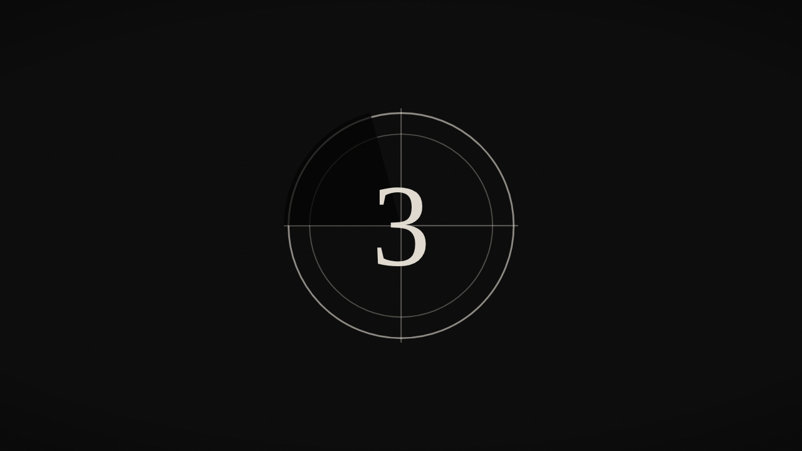

# Cinema Hall — دار العرض

<div dir="rtl">

**عميل Stremio للكمبيوتر، مبني ليشتغل كأنه صالة سينما حقيقية على شاشة التلفزيون.**

مثل [Harbor](https://github.com/harborstremio/harbor)، البرنامج عميل مستقل يستخدم بروتوكول إضافات
Stremio المفتوح — لكن الفرق أن واجهته ليست واجهة تطبيق، بل **دار عرض**: لمّا توصله بالتلفزيون
يفتح مباشرة على شاشة اللوبي، يعرض لوحة مواعيد العروض، إعلانات الأفلام القادمة، وتنبيهات الصالة
(«الرجاء إسكات الهواتف»، «ممنوع التصوير»)، وقبل كل فيلم يشغّل مقدمة كاملة: ستارة، إعلانات،
بطاقة الفيلم، ثم عدّاد البداية — وما يبان في أي لحظة أن المصدر كمبيوتر.

</div>



---

<div dir="rtl">

## التحميل

**نسخة جاهزة (بدون تثبيت أي شيء):** كل دفعة على المستودع تبني المثبّتات تلقائياً.
افتح تبويب **Actions** ← آخر تشغيل ناجح لـ *Build installers* ← نزّل الملف من قسم **Artifacts**:

| النظام | الملف |
|---|---|
| Windows | `CinemaHall-windows` — يحوي مثبّت `Setup` ونسخة `Portable` تشتغل بدون تثبيت |
| macOS | `CinemaHall-macos` — ملف `.dmg` |
| Linux | `CinemaHall-linux` — `.AppImage` و `.deb` |

ولإصدار رسمي في صفحة **Releases** بدل الـ Artifacts، ادفع وسم نسخة:

```bash
git tag v1.0.0
git push origin v1.0.0
```

> ملاحظة: النسخ غير موقّعة رقمياً. ويندوز قد يعرض تحذير SmartScreen أول مرة —
> اضغط *More info* ثم *Run anyway*. وعلى macOS: زر يمين على التطبيق ← *Open*.

**من المصدر:** انظر [التشغيل](#التشغيل) بالأسفل.

## المميزات

| | |
|---|---|
| **شاشة اللوبي** | دورة تلقائية: لوحة المواعيد ← بطاقة فيلم يُعرض الآن ← إعلان فيلم قادم ← تنبيه صالة، وتتكرر. تشتغل تلقائياً عند الإقلاع وبعد أي فترة سكون. |
| **مقدمة ما قبل الفيلم** | ستارة مخملية تُفتح، تنبيهات الصالة، إعلانات الأفلام القادمة بالصوت، بطاقة «العرض الرئيسي»، ثم عدّاد أكاديمي ٥-٤-٣-٢. أي زر يتخطى المشهد الحالي، و`Esc` يتخطى المقدمة كاملة. |
| **مواعيد عرض حقيقية** | كل فيلم يُوزَّع على صالة ورقم عرض وصيغة (IMAX / Dolby Atmos / 4DX / VIP) ومواعيد ثابتة لا تتغيّر عند إعادة التشغيل. |
| **وضع الصالة** | ملء شاشة بلا إطار ولا شريط مهام ولا مؤشر فأرة، مع منع إطفاء الشاشة، واختيار شاشة التلفزيون تلقائياً عند توصيلها. |
| **تحكّم بالريموت** | تنقّل اتجاهي كامل بالأسهم، مع لوحة مفاتيح على الشاشة للبحث (عربي/إنجليزي). |
| **بروتوكول Stremio v3** | كتالوجات، بيانات، مصادر عرض، وبحث من أي إضافة. يعمل مباشرة مع Cinemeta، ويقدر يجلب إضافاتك من حسابك في Stremio. |
| **عربي/إنجليزي** | الواجهة كاملة بالاتجاهين، مع اتجاه نص تلقائي لأسماء الأفلام الإنجليزية داخل واجهة عربية. |
| **يشتغل بدون إنترنت** | برنامج تجريبي كامل (أفلام من تأليف البرنامج وبوسترات مرسومة برمجياً) حتى تشوف الشكل النهائي من أول تشغيل. |

## التشغيل

```bash
npm install
npm start          # وضع الصالة (ملء الشاشة)
npm run dev        # وضع نافذة + أدوات المطوّر
```

### بناء نسخة تثبيت

```bash
npm run dist:win     # Windows  (مثبّت NSIS + نسخة محمولة)
npm run dist:mac     # macOS    (DMG)
npm run dist:linux   # Linux    (AppImage + deb)
```

الملفات تطلع في مجلد `release/`.

## التوصيل بالتلفزيون

1. وصّل التلفزيون بـ HDMI وشغّل البرنامج.
2. البرنامج يختار **الشاشة الخارجية** تلقائياً. لو اخترت غيرها: الإعدادات ← العرض والشاشة ← الشاشة المستخدمة.
3. لو التلفزيون يقصّ حواف الصورة، زد **هامش أمان حواف التلفزيون**.
4. فعّل **تشغيل تلقائي عند بدء النظام** ليفتح على اللوبي مباشرة عند تشغيل الجهاز.

## المصادر

يشتغل من أول تشغيل على **Cinemeta** (كتالوج Stremio الرسمي المجاني).

- **إضافة إضافة:** الإعدادات ← المصادر والإضافات ← إضافة إضافة جديدة، وألصق رابط `manifest.json`.
- **حسابك في Stremio:** الإعدادات ← حساب Stremio ← تسجيل الدخول. تُجلب كل إضافاتك المثبّتة تلقائياً. (اختياري تماماً.)

### تشغيل الروابط

| نوع المصدر | يحتاج؟ |
|---|---|
| روابط مباشرة `http/https` و `HLS` (إضافات debrid والمستضيفات) | لا شيء — تشتغل فوراً |
| تورنت (`infoHash`) | خادم بث Stremio يعمل على `127.0.0.1:11470` |
| YouTube | يشتغل داخل البرنامج |

خادم البث هو نفسه الذي يأتي مع تطبيق Stremio الرسمي؛ يكفي تشغيل Stremio في الخلفية، أو
`stremio-server` بشكل منفصل. حالته تظهر في الإعدادات ← المصادر والإضافات.

## أزرار التحكم

| الزر | الوظيفة |
|---|---|
| الأسهم | تنقّل (وفي اللوبي: تقليب الشرائح) |
| `Enter` / `Space` | اختيار — وفي المشغّل: تشغيل/إيقاف |
| `Esc` / `Backspace` | رجوع — وفي المقدمة: تخطّيها كاملة |
| `S` | الإعدادات |
| `/` | البحث |
| `A` | العودة لشاشة اللوبي فوراً |
| `←` `→` (أثناء العرض) | تقديم/تأخير ١٠ ثوانٍ |
| `PgUp` / `PgDn` | تقديم/تأخير ٥ دقائق |
| `↑` `↓` (أثناء العرض) | الصوت |
| `M` | كتم الصوت |
| `F10` | تبديل وضع الصالة |
| `Ctrl+Shift+Q` | إغلاق البرنامج |

</div>

---

## English

A desktop Stremio client that presents itself as a cinema auditorium rather than an app.
Like [Harbor](https://github.com/harborstremio/harbor) it is an independent client for the open
Stremio add-on protocol — the difference is the shape of it. Connect a PC to a television and it
opens on a foyer screen: the showtime board, coming attractions, and house notices. Choose a
film and it runs a full pre-show — curtain, notices, trailers, title card, Academy countdown —
before the feature. Nothing on screen suggests a computer.

| | |
|---|---|
| **Lobby attract loop** | Showtime board → now-showing hero → coming-attraction trailer → house notice, on repeat. Starts at boot and returns after any idle period. |
| **Pre-show ceremony** | Velvet curtain, house notices, trailers with sound, a "Feature Presentation" title card, then a 5-4-3-2 Academy leader. Any key skips a beat; `Esc` skips the lot. |
| **A real programme** | Every title gets an auditorium, a format (IMAX / Dolby Atmos / 4DX / VIP) and a run of showtimes, derived deterministically from its id so the board is stable across restarts. |
| **Auditorium mode** | Frameless fullscreen, no taskbar, no cursor, display kept awake, and the external screen picked automatically when a TV is plugged in. |
| **Remote-first** | Geometric D-pad navigation throughout, with an on-screen keyboard (Arabic/Latin) for search. |
| **Stremio v3 protocol** | Catalogs, metas, streams and search from any add-on. Works out of the box on Cinemeta; can sync the add-on collection from a Stremio account. |
| **Arabic & English** | Full RTL/LTR UI, with automatic per-string direction so English titles read correctly inside the Arabic interface. |
| **Works offline** | A complete demo house — invented titles, procedurally drawn posters — so it looks finished on first launch. |

### Download

Every push builds installers for all three platforms. Grab one from the
**Actions** tab → latest *Build installers* run → **Artifacts**. Push a `v*` tag
to publish them as a GitHub Release instead. Builds are unsigned, so Windows
SmartScreen and macOS Gatekeeper will each want one confirmation on first launch.

### Run and build

```bash
npm install
npm start                              # auditorium mode
npm run dev                            # windowed + devtools
npm run dist:win | dist:mac | dist:linux
npm test                               # 27 unit + contract tests
node test/visual.js                    # render every screen to test/shots/
node test/visual.js --docs             # refresh docs/screens
```

### Playback

Direct HTTP/HLS streams play immediately. Torrent streams (`infoHash`) need a Stremio streaming
server on `127.0.0.1:11470` — the same one the official Stremio app runs; its status is shown in
Settings → Sources.

### Project layout

```
src/core/          pure Node, no Electron — unit-tested in isolation
  addons.js          Stremio add-on protocol v3 client
  stremio-api.js     optional account login + add-on collection sync
  server.js          streaming-server bridge (torrent → HTTP)
  program.js         the cinema programme: schedules, showtimes, the reel
  demo.js            offline house with procedurally drawn artwork
  store.js           JSON settings
src/main/          Electron: kiosk window, TV display targeting, IPC
src/renderer/      the auditorium — views, D-pad navigation, cinema CSS
test/              unit tests, IPC-contract tests, Playwright visual harness
```

The renderer never touches Node or Electron directly; everything crosses a single
`contextBridge` surface (`window.cinema`), and a test enforces that both ends of it stay in sync.

### Screens

| Lobby board | Now showing | Foyer |
|---|---|---|
|  |  |  |

| Title page | House notice | Countdown |
|---|---|---|
|  |  |  |

### Note

Cinema Hall ships no content. It plays only what the add-ons you choose to install return, exactly
like any other Stremio client — what you install and stream is your responsibility.

MIT licensed.
